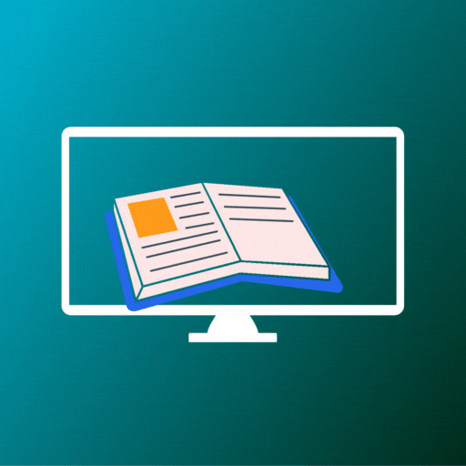

# YouLearn

YouTube is a popular platform that many people use to access educational resources, but it was not designed specifically for learning. One of the drawbacks of using YouTube for learning is that it does not offer features to track progress in real-time or provide visual motivation through tools like bar graphs. Additionally, the suggested videos that appear on the side of the page can be a distraction and disrupt the learner's focus. YouLearn is a platform that was created to address these issues and enhance the learning experience. It is specifically designed to optimize the learning process and provide a more focused, effective and enjoyable way to study.

## Tech Stack

**Client:** HTML/CSS, JavaScript, TailwindCSS 

**Server:** Python, Flask, Deta Base, Deta Space

## Contributing

Contributions are always welcome!
